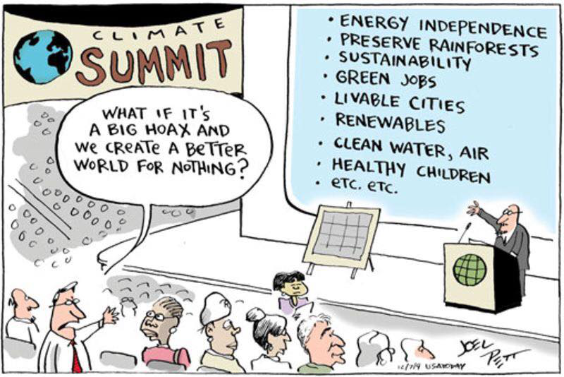
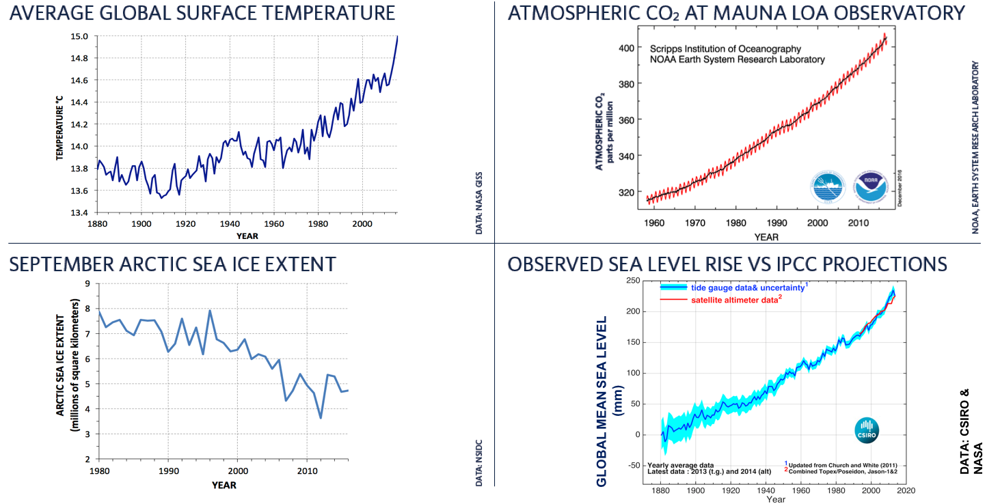
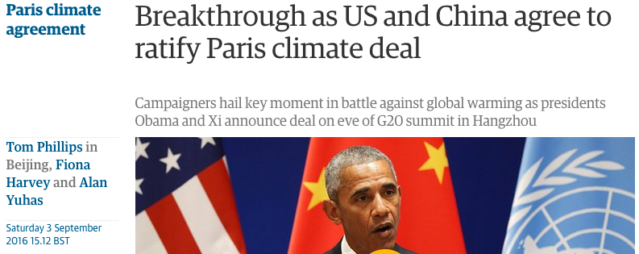
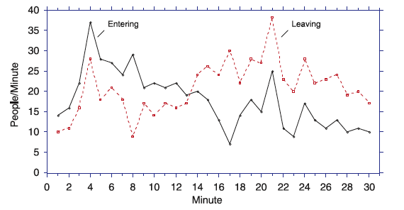
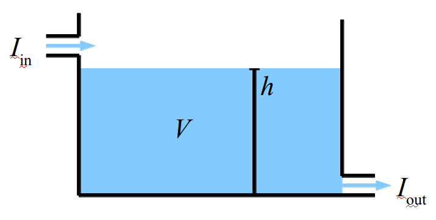

---
jupyter:
  jupytext:
    text_representation:
      extension: .md
      format_name: markdown
      format_version: '1.2'
      jupytext_version: 1.7.1
---

<!-- #region -->

# Slide 0
```

Goals:
Define stock, flow, and feedback
Explain how the combined history of inflows and outflows determines a stock
Predict what happens to stocks and flows when a system is perturbed
Construct examples of both amplifying and stabilizing feedbacks.
Systems: Stocks, Flows,
& Feedbacks
1

```




<!-- #endregion -->


# Slide 1
```

Climate news
Hurricane Dorian stalls over the Bahamas
Here’s what the original research looks like:
Hall and Kossin – 2019
Fires in Australia
2

```


# Slide 2
```

Question: Why don’t we put the answers to the clicker questions up on canvas?
3

```


<!-- #region -->

# Slide 3
```

Worksheets from Day 1: Sea ice
Stories:  Attempts to connect these different data through various processes.  Common story: “CO2 causes T to rise, which causes sea ice to melt, which causes sea level to rise”  [one problematic link…]
4

```




<!-- #endregion -->

<!-- #region -->

# Slide 4
```

Questions/Comments: Worksheet
1. Sea ice versus land ice 
   – impact on sea level
http://commons.wikimedia.org/wiki/File:Menthaleau.jpg
Once this ice melts in this glass, how will the water level be different?  Water level will be ______before.
higher than
lower than
the same as
5

```


<!-- #endregion -->


# Slide 5
```

More on buoyancy
Suppose that ice was 70% as dense as water.  If you froze a block of liquid water, how much of the volume would be above the surface?

A) 10%
B) 30%
C) 50%
D) 70%
    E)  90%
6

```


# Slide 6
```

Questions/Comments: Pre-Class Quiz
Stoichiometry practice
Say we have 100 gigatons of H2O.
How many gigatons of O is contained within that 100 Gton H2O?
2
89
98
100
102
Quiz question involved the mass of C in CO2.
You will need to be able to go back and forth between mass of C and mass of CO2 in this course.
7

```


<!-- #region -->

# Slide 7
```

Caldeira, 2012- Pre class reading
“One of the greatest uncertainties in climate prediction is the amount of CO2 that will ultimately end up in the atmosphere”
Some text from the Dec 2015 Paris agreement:
Emphasizing with serious concern the urgent need to address the significant gap between the aggregate effect of Parties’ mitigation pledges in terms of global annual emissions of greenhouse gases by 2020 and aggregate emission pathways consistent with holding the increase in the global average temperature to well below 2 °C above pre-industrial levels and pursuing efforts to limit the temperature increase to 1.5 °C,
8

```




<!-- #endregion -->

<!-- #region -->

# Slide 8
```

Figure: Cronin & Gonzalez, 2007
We’ll work with this plot during class.  See post-class slides for more.
9

```




<!-- #endregion -->

<!-- #region -->

# Slide 9
```

Figure: Cronin & Gonzalez, 2007
Clicker Q: The graph below shows the numbers of people entering and leaving a store each minute. During which minute did the most people enter the store?
Minute 4
Minute 8
Minute 13
Minute 21
Cannot be determined
10

```


<!-- #endregion -->

<!-- #region -->

# Slide 10
```

Figure: Cronin & Gonzalez, 2007
Clicker Q: The graph below shows the numbers of people entering and leaving a store each minute. During which minute did the most people leave the store?
Minute 4
Minute 8
Minute 17
Minute 21
Cannot be determined
11

```


<!-- #endregion -->

<!-- #region -->

# Slide 11
```

Figure: Cronin & Gonzalez, 2007
Clicker Q: The graph below shows the numbers of people entering and leaving a store each minute. During which minute were the MOST people in the store?
Minute 4
Minute 8
Minute 13
Minute 17
Cannot be determined
12

```


<!-- #endregion -->

<!-- #region -->

# Slide 12
```

Figure: Cronin & Gonzalez, 2007
Clicker Q: The graph below shows the numbers of people entering and leaving a store each minute. During which minute were the FEWEST people in the store?
Minute 1
Minute 13
Minute 17
Minute 30
Cannot be determined
13

```


<!-- #endregion -->


# Slide 13
```

Systems dynamics: Stock & Flow
STOCK:  Amount or quantity of something residing in a particular place at a particular time
apples in a basket, water in a glacier, fish in the sea, knowledge in your brain…
FLOW:  The rate at which stuff adds or subtracts from a stock.  Since flow is a RATE, there is always an element of TIME included.
apples picked per hour, water melted per month, fish born per year,
knowledge GAINED PER 90MIN EOSC340 CLASS
INFLOW:  The rate at which stuff flows IN.
OUTFLOW:  The rate at which stuff flows OUT.
The STOCK, at any moment, is the result of the COMBINED HISTORY of INFLOW and OUTFLOW
Inflow
Outflow
STOCK
14

```


# Slide 14
```

Systems dynamics: Stock & Flow
The RATE AT WHICH THE STOCK CHANGES, is the difference between the INFLOW & the OUTFLOW
If Flowin = Flowout
no change in stock over time
 EQUILIBRIUM
If Flowin ≠ Flowout  stock will change over time
15

```


# Slide 15
```

Stock & Flow Worksheet
Work in pairs or 3s.  Once you have a pair or a 3, raise your hands and we’ll get you a worksheet
16

```


# Slide 16
```

Worksheet PROBLEM 1 clicker:
17

```


# Slide 17
```

Worksheet PROBLEM 2 clicker:
Worksheet problem 2:
At what minute are inflow and outflow equal?
0
1
2
18

```


# Slide 18
```

Worksheet PROBLEM 2 clicker:
19

```


# Slide 19
```

Worksheet PROBLEM 2 clicker:
20

```


# Slide 20
```

Worksheet PROBLEM 3 clicker:
21

```


# Slide 21
```

FEEDBACKS:  Amplifying vs Stabilizing
AMPLIFYING FEEDBACK: A response to a forcing that pushes the system in THE SAME direction as the forcing pushed it. E.g. if a forcing increased global temperature, an amplifying feedback would increase global temperature further, which would keep the feedback process going.
STABILIZING FEEDBACK: A response to a forcing that pushes the system in THE OPPOSITE direction as the forcing pushed it. E.g. if a forcing increased global temperature, a stabilizing feedback would respond and DEcrease global temperature, which would stabilize the system (not necessarily at the original T).
Note: Some of you know “amplifying” feedbacks as “positive” feedbacks, and “stabilizing” feedbacks as “negative” feedbacks
22

```


<!-- #region -->

# Slide 22
```

Clicker Q:
Amplifying
Stabilizing
No idea
Is this an amplifying or stabilizing feedback?
23

```




<!-- #endregion -->

<!-- #region -->

# Slide 23
```

Now with math
You have 5 gigatons of carbon and two sources, one adding 0.5 Gigatons per year and another source that is increasing every year. In other words, something like:
24
After 10 years how many Gtons of carbon are there?  i.e.  what is y(10)?  Pick the closest answer.
2 Gt
5 Gt
15 Gt
20 Gt
A little help please

```


<!-- #endregion -->


# Slide 24
```

Feedbacks link stocks and flows
Flow depends on a stock, which depends on the flow.
A perturbation could happen to EITHER the stock or the flow. The ramifications then feed back between stock and flow.
These are all “stabilizing” feedbacks
Jupiter’s growth: example of amplifying feedback
25

```


# Slide 25
```

In your pair or 3, come up with as many amplifying feedbacks and as many stabilizing feedbacks as you can.  Not climate-related.  Make stuff up, don’t google it.
Feedback Examples
26

```


# Slide 26
```

In your pair or 3, come up with at least 5 climate-related stocks.  For each, come up with as many climate-related flows as you can.
Climate Stocks & Flows
27

```


# Slide 27
```

Earth’s climate system is essentially a whole bunch of interconnected stocks, flows, and feedbacks.
The combination of inflows and outflows over time determines a stock.
Both stocks and flows can be perturbed.  When a perturbation happens, the system responds.
Perturbations in stocks can influence flows, which in turn can influence stocks again.
Perturbations in flows can influence stocks, which in turn can influence flows again.
4.   Amplifying feedbacks destabilize a system by reinforcing perturbations.  Stabilizing feedbacks counteract perturbations and help move a system toward a stable state.
Summary
28

```

